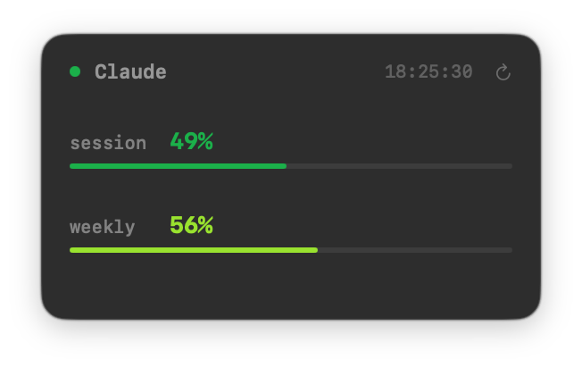
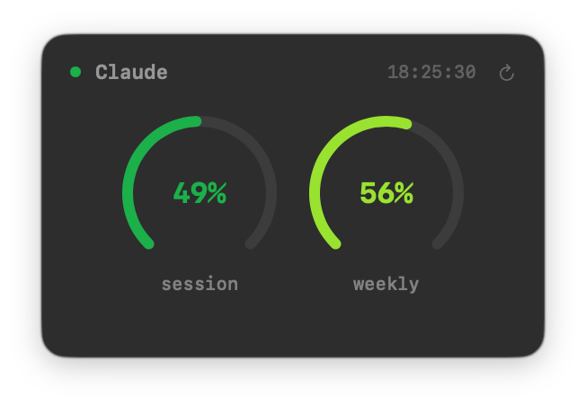
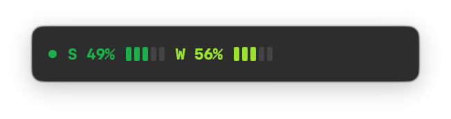

# Simple Claude Monitor

A lightweight macOS menu bar app that displays your Claude API usage as a floating desktop widget.

## Screenshots

| Bars | Gauges | Mini |
|------|--------|------|
|  |  |  |

## Download

**[Download SimpleClaudeMonitor.dmg](https://github.com/lexey111/SimpleClaudeMonitor/releases/latest/download/SimpleClaudeMonitor-1.3.0.dmg)**

### Install

1. Open the DMG and drag **SimpleClaudeMonitor** to **Applications**
2. **Important — the app is not notarized**, so macOS will block it on first launch:
   - Open **System Settings → Privacy & Security**
   - Scroll down to the Security section — you'll see a message about SimpleClaudeMonitor being blocked
   - Click **Open Anyway**, then confirm in the dialog
   - Alternatively: right-click the app in Applications → **Open** → **Open** in the dialog
3. On first launch, allow Keychain access to "Claude Code-credentials" when prompted

> Requires macOS 15.0+ and [Claude Code](https://docs.anthropic.com/en/docs/claude-code) logged in (`claude login`).

## Features

- **Three display modes** — Bars, Gauges, and Mini, switchable via menu bar (Cmd+1/2/3)
- **Floating widget** — always-on-top translucent panel showing session (5-hour) and weekly (7-day) usage
- **Unified color scale** — blue → green → greenyellow → yellow → orange → red based on utilization
- **Live countdown** — reset timers appear when utilization exceeds 80%
- **Menu bar icon** — gauge icon with mode switching, About, and Quit
- **Auto-polling** — refreshes usage data every 2 minutes, with a manual refresh button
- **Limit detection** — visual warning when session usage hits 100%
- **Mode persistence** — last selected mode is remembered across restarts

## How It Works

The app reads the OAuth token that [Claude Code](https://docs.anthropic.com/en/docs/claude-code) stores in the macOS Keychain (`Claude Code-credentials`), then polls the Anthropic usage API to retrieve current utilization percentages.

## Prerequisites

- macOS 15.0+
- Xcode 26+
- **Claude Code** must be installed and logged in (`claude login`) so the OAuth token exists in Keychain

## Setup

1. Clone the repository
2. Open `SimpleClaudeMonitor.xcodeproj` in Xcode
3. Build and run (Cmd+R)

On first launch the system will ask for Keychain access to "Claude Code-credentials" — click **Always Allow** to avoid repeated prompts.

> **Note:** The app is signed locally ("Sign to Run Locally"). After each rebuild the Keychain prompt may appear once because the code signature changes.

## Architecture

| File | Purpose |
|---|---|
| `SimpleClaudeMonitorApp.swift` | App entry point, `AppDelegate` that creates the floating `NSPanel`, menu bar icon with mode switching, and animated window resizing |
| `FloatingWidget.swift` | SwiftUI view — three display modes (bars, arc gauges, mini), unified color scale, and status indicators |
| `UsageMonitor.swift` | `ObservableObject` with `DisplayMode` enum, Keychain token reading, API polling, and mode persistence via `UserDefaults` |

## Configuration

The app runs as a background accessory (no Dock icon). It is controlled entirely through:

- **The floating widget** — drag to reposition, click the refresh button for an immediate update
- **The menu bar icon** — switch between Bars/Gauges/Mini modes (Cmd+1/2/3), About, Quit

## License

MIT
